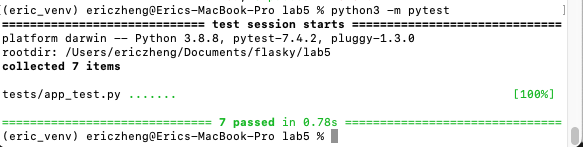

# ECE444-F2023-Lab5
This repo is reproduced based on https://github.com/mjhea0/flaskr-tdd
### Pros and Cons of TDD
- Pros   
    - TDD helps the software develpers for a more efficient debugging process. By writing testcases, the developer should
    have a general sense of what they are tryting to test with certain test case. If the testcase fails, the developer 
    can easily locate the cause of problem and have them fixed.
    - TDD helps the code to be easier maintained in a collabrated workspace. By submitting the code to a shares repo
    only if the code is well tested and ensures error free, this ensures one member's submission will not break the 
    whole system, and causing the entire system not working. Thus, making a stable work environment and making the 
    shared repo easier to maintain
- Cons   
    - TDD requires that the software developer has an idea of what the expected result will be for a certain function.
    The software developer will need to provide an expected ouput for a testcase and using pytest to compare if the 
    actual result is consistent with the expected result. However, providing an expected output will be quite difficult
    if we have a sophiscated algorithm, specifically, a recursive algorithm. For example, if we are building a game and 
    we are using Minimax, it is really difficult to find the expected output and the expected output computed by hand
    also has a great possibility to be erroneous, which is also the second con. 
    - If the software developer provides an erroneous expected output for the testcase. Then TDD can be misleading
    and causing confusions in the debug process. And also, the provided testcases may not cover all the potential
    errors in the code. It is very common that the code passes all the testcases developed but still has some 
    corner cases unchecked. The development of testcases also need to be careful.
### Final web page and test results:   
    
    
    
    

